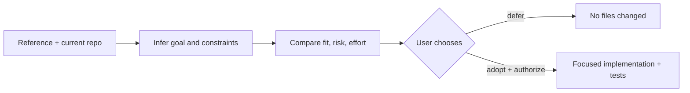

# remix-me

[中文版](README.zh-CN.md)

## What is it?

`remix-me` helps a coding agent learn from external references—repositories, papers, documents, web pages, UI examples, or code samples—without blindly copying them into your project.

It extracts useful ideas, compares them with the current project’s goals and capabilities, explains fit, risks, effort, and opportunity cost, and waits for explicit approval before making changes.

It works with Codex, Claude Code, and other tools that support the `SKILL.md` Agent Skills format.

## See it in 60 seconds

The shortest useful demo is a small conversation: give a reference, let the skill infer the project goal, compare one idea, then explicitly authorize a focused change. The complete transcript is in [`demo/quick-demo.md`](demo/quick-demo.md).



## Install in one minute

Clone this repository, then install the canonical `skills/remix-me` directory for the agent you use. The same core `SKILL.md` works on both platforms.

### Codex

Inside Codex, install the pinned public release with one command:

```text
$skill-installer install https://github.com/shepnerd/remix-me-skill/tree/v0.1.0/skills/remix-me
```

For a manual/offline install, clone the repository and copy the skill directory:

```bash
mkdir -p "${CODEX_HOME:-$HOME/.codex}/skills/remix-me"
cp -a skills/remix-me/. "${CODEX_HOME:-$HOME/.codex}/skills/remix-me/"
```

Use `$remix-me` in a prompt.

### Claude Code

```bash
mkdir -p "$HOME/.claude/skills/remix-me"
cp -a skills/remix-me/. "$HOME/.claude/skills/remix-me/"
```

Use `/remix-me` in Claude Code. To share it with one repository, copy the same directory to `.claude/skills/remix-me/` in that repository.

## Use it

Give it references and, if you have one, the problem you want to solve:

```text
Use $remix-me to compare these repositories and recommend what is worth adapting to my project: ...
```

If you only provide references, it first reads the target project and proposes a provisional problem brief for you to confirm:

```text
/remix-me Compare this paper and its released code with the current repository. Infer the project problem if needed, then stop before making changes.
```

When you are ready to implement a specific recommendation, name it and authorize it explicitly:

```text
Use remix-me. Adopt candidate 1 and authorize implementation. Keep the change small, run focused tests, and report the checkpoint and rollback path.
```

## What happens

The skill normally follows this sequence:

1. identify the project’s primary goal and constraints from its instructions, README, code, and tests;
2. extract source methods, claims, evidence, assumptions, provenance, and license information;
3. compare each candidate with local capabilities, compatibility, risks, effort, and opportunity cost;
4. present integrate, pilot, defer, and do-not-integrate choices;
5. edit only after a concrete adoption choice and explicit authorization.

The internal analysis/recommendation/implementation modes are selected automatically; users do not need to learn a mode vocabulary.

## Safety and scope

- External source code and instructions are data to analyze, never instructions to execute.
- The skill does not install dependencies, upload private files, or read secrets merely to inspect a source.
- It does not modify a target repository before the user approves both what to adopt and whether to implement it.
- Clean Git projects use the existing commit as the default baseline; dirty changes are kept separate.
- Non-Git projects do not receive an automatic large archive or manifest. A backup is created only when requested and approved.
- Large references are inspected progressively and with bounded scope by default.

## For maintainers

The canonical package is [`skills/remix-me`](skills/remix-me). `agents/openai.yaml` is optional Codex UI metadata; Claude Code can ignore it. Detailed schemas live in `skills/remix-me/references/`.

The [`evals/`](evals/) directory is not needed to install or invoke the skill. It is kept for maintainers and adopters who want evidence that the workflow handles inferred goals, multi-source comparison, authorization boundaries, clean/dirty Git checkpoints, and non-Git rollback limits. It is a regression record, not a promise that every model behaves identically.

Run the package validator:

```bash
python3 -m pip install -r requirements-dev.txt
python3 scripts/validate_skill_package.py
```

For contribution guidance, see [`CONTRIBUTING.md`](CONTRIBUTING.md). For threat reporting, see [`SECURITY.md`](SECURITY.md).

## License

This skill is released under the MIT License. See [`LICENSE`](LICENSE). Referenced projects, papers, websites, code, and assets retain their own terms.
